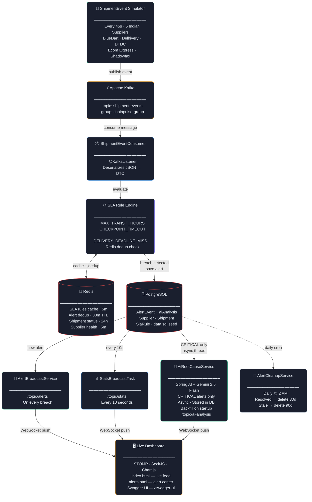
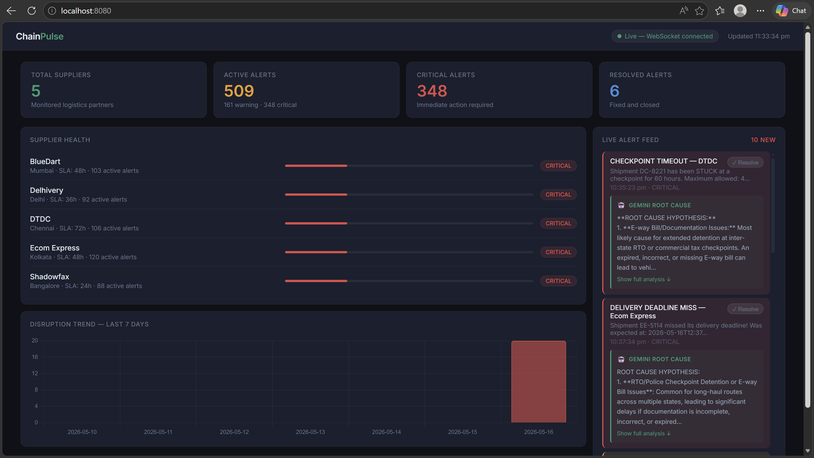
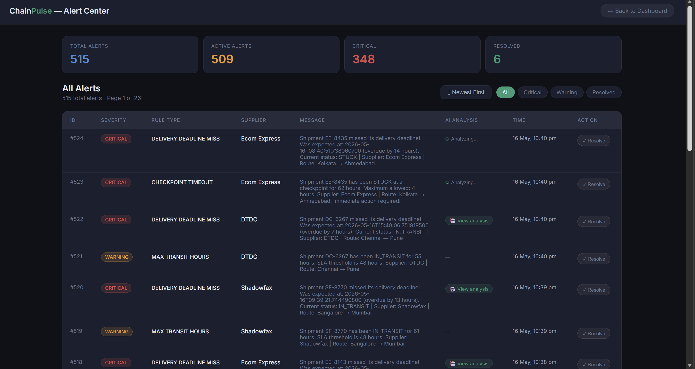
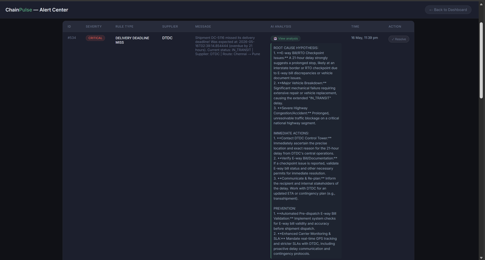

# **ChainPulse**
### AI-Powered Supply Chain Disruption Alert Engine

[](https://spring.io/projects/spring-boot)
[](https://openjdk.org/projects/jdk/21/)
[](https://kafka.apache.org/)
[](https://redis.io/)
[](https://www.postgresql.org/)
[](https://stomp.github.io/)
[](https://spring.io/projects/spring-ai)
[](https://ai.google.dev/)
[](https://www.docker.com/)
[](https://opensource.org/licenses/MIT)

---

## What is ChainPulse?

ChainPulse is a real-time supply chain monitoring system that ingests shipment events from Apache Kafka, evaluates them against configurable SLA rules, and fires alerts the moment a breach is detected. Alerts are persisted to PostgreSQL, deduplicated via Redis TTL keys, and pushed to a live dashboard over STOMP/WebSocket — no polling, no page refresh. For every `CRITICAL` alert, the system spins off an async thread that calls **Google Gemini 2.5 Flash** via Spring AI to generate a concise root cause analysis (factoring in Indian logistics specifics — E-way bills, RTO checkpoints, national highway delays) and broadcasts it back to the dashboard in real time.

The entire stack — Kafka, Zookeeper, Redis — is docker-composed into a single command. The app is built on **Spring Boot 4** with Java 21, using only standard Spring idioms (no external frameworks beyond the core stack), which keeps the codebase legible and production-refactorable.

---

## Architecture


---

## Key Features

- **Event-driven pipeline** — shipment events flow Simulator → Kafka → Consumer → Rule Engine in a clean, decoupled chain. Each stage is independently replaceable; swap the simulator for real supplier webhooks without touching anything else.

- **Multi-type SLA rule engine** — three rule types evaluated per event: `MAX_TRANSIT_HOURS` (IN_TRANSIT too long), `CHECKPOINT_TIMEOUT` (STUCK at a checkpoint), and `DELIVERY_DEADLINE_MISS` (overdue delivery). Rules can be global or supplier-specific, and toggled live via REST without a restart.

- **Redis-backed alert deduplication** — before writing an alert to PostgreSQL, the engine checks a Redis key `alert:dedup:{shipmentId}:{ruleType}` with a 30-minute TTL. A simulator firing every 45 seconds on the same shipment will only produce one alert per 30-minute window. No database locks, no complex state.

- **Multi-layer Redis caching** — SLA rules cached for 5 minutes (evicted on rule mutation), shipment statuses for 24 hours, supplier health scores for 5 minutes. Cache eviction is explicit and targeted — no cache stampede.

- **Real-time WebSocket push** — STOMP over SockJS on `/ws`. Three broadcast channels: `/topic/alerts` (new alerts), `/topic/stats` (dashboard metrics every 10s), `/topic/ai-analysis` (Gemini output when ready). The browser never polls.

- **Async AI root cause analysis** — CRITICAL alerts trigger a raw `Thread` (intentionally lightweight — no thread pool overhead for a fire-and-forget AI call) that hits Gemini 2.5 Flash via Spring AI's `ChatClient`. The analysis is stored back to `AlertEvent.aiAnalysis` (8000 chars) so it's never regenerated for the same alert.

- **Startup backfill** — on `ApplicationReadyEvent`, the system scans for CRITICAL alerts with null `ai_analysis` (e.g. app was killed mid-analysis) and backfills them with 2-second gaps to respect Gemini rate limits.

- **Scheduled alert cleanup** — a `@Scheduled(cron = "0 0 2 * * *")` job deletes resolved alerts older than 30 days and stale unresolved alerts older than 90 days, keeping PostgreSQL lean without manual intervention.

---

## How It Works

**Step 1 — Event Generation**
`ShipmentEventSimulator` fires every 45 seconds, picking one of five real Indian logistics suppliers (BlueDart, Delhivery, DTDC, Ecom Express, Shadowfax) and a weighted shipment status (40% IN_TRANSIT, 25% DELAYED, 20% STUCK, 15% DELIVERED). It constructs a `ShipmentEventDto` with a tracking number, dispatch time (0–72h ago), and expected delivery time, then publishes it to Kafka topic `shipment-events`.

**Step 2 — Kafka Consumption**
`ShipmentEventConsumer` deserializes the JSON message into `ShipmentEventDto` using a `JavaTimeModule`-configured `ObjectMapper`, logs the event, and hands it to `SlaRuleEngine.evaluate()`.

**Step 3 — Rule Loading with Cache**
`SlaRuleEngine` checks Redis key `sla:rules:active` first. On a cache hit, rules are deserialized from JSON. On a miss, it queries PostgreSQL for both global rules and supplier-specific rules, merges them, serializes the list back to Redis with a 5-minute TTL.

**Step 4 — Rule Evaluation**
Each rule is evaluated by type: transit hours are computed via `ChronoUnit.HOURS.between(dispatchedAt, now)`, checkpoint timeout checks `STUCK` status against threshold, delivery deadline compares `now()` against `expectedAt`. A breach builds a human-readable alert message including tracking number, hours overdue, supplier name, and route.

**Step 5 — Deduplication and Persistence**
Before writing, the engine calls `RedisService.isDuplicateAlert()`. If the TTL key exists, the alert is dropped silently. Otherwise the `AlertEvent` is saved to PostgreSQL, `AlertBroadcastService.broadcastAlert()` pushes it to `/topic/alerts`, and `markAlertFired()` writes the dedup key.

**Step 6 — AI Analysis (CRITICAL only)**
For CRITICAL severity, a new `Thread` sleeps 1 second (rate-limit buffer), then calls `AiRootCauseService.analyzeAlert()`. If the alert already has a non-blank `aiAnalysis`, the Gemini call is skipped entirely — idempotent by design. Otherwise Spring AI's `ChatClient` sends a structured prompt with alert metadata and Indian logistics context to Gemini 2.5 Flash. The response (max 200 words, structured as ROOT CAUSE / IMMEDIATE ACTIONS / PREVENTION) is persisted to the `ai_analysis` column and broadcast to `/topic/ai-analysis`.

**Step 7 — Live Dashboard**
The browser (SockJS + STOMP) subscribes to all three topics at page load. New alerts appear instantly in the feed. `StatsBroadcastTask` pushes fresh metric counts (total/active/critical/warning/resolved alerts) every 10 seconds — the four dashboard cards update without any user interaction.

---

## Project Structure

```
src/main/java/com/chainpulse/chainpulse/
│
├── kafka/
│   ├── ShipmentEventSimulator.java   — @Scheduled simulator, 5 Indian suppliers
│   ├── ShipmentEventConsumer.java    — @KafkaListener, wires into SlaRuleEngine
│   ├── KafkaProducerService.java     — publishes events to shipment-events topic
│   └── dto/ShipmentEventDto.java     — Kafka message payload
│
├── service/
│   ├── SlaRuleEngine.java            — rule loading (Redis→DB), evaluation, alert creation
│   ├── RedisService.java             — dedup, SLA state, supplier health, rules cache
│   ├── AlertBroadcastService.java    — WebSocket push to /topic/alerts|stats|ai-analysis
│   ├── AiRootCauseService.java       — Spring AI + Gemini, backfill on startup
│   ├── StatsBroadcastTask.java       — @Scheduled 10s stats push
│   └── AlertCleanupService.java      — @Scheduled cron daily cleanup
│
├── controller/
│   ├── AlertController.java          — GET/PUT /api/alerts (paginated, stats, trend, resolve)
│   ├── SupplierController.java       — GET /api/suppliers, /health (Redis-cached)
│   ├── SlaRuleController.java        — CRUD + toggle for SLA rules
│   ├── ShipmentController.java       — shipment tracking endpoints
│   └── StatsController.java          — GET /api/stats (live dashboard metrics)
│
├── entity/
│   ├── AlertEvent.java               — alert_events table, includes ai_analysis column
│   ├── SlaRule.java                  — sla_rules table, RuleType + AlertSeverity enums
│   ├── Supplier.java                 — suppliers table, slaThresholdHours field
│   └── Shipment.java                 — shipments table, ShipmentStatus enum
│
├── config/
│   ├── KafkaConfig.java              — consumer factory, listener container factory
│   ├── RedisConfig.java              — RedisTemplate<String, String> bean
│   ├── WebSocketConfig.java          — STOMP broker, /ws endpoint, SockJS fallback
│   └── SwaggerConfig.java            — OpenAPI metadata, tag descriptions
│
└── repository/                       — Spring Data JPA repositories with custom queries
    ├── AlertEventRepository.java
    ├── SlaRuleRepository.java
    ├── SupplierRepository.java
    └── ShipmentRepository.java

src/main/resources/static/
├── index.html    — live dashboard (metrics, Chart.js trend, real-time alert feed)
└── alerts.html   — paginated alert center with severity filters
```

---

## Getting Started

### Prerequisites

- Java 21
- Maven 3.9+
- Docker + Docker Compose
- A **Google AI API key** with access to Gemini (get one at [aistudio.google.com](https://aistudio.google.com/))
- PostgreSQL running locally (or update `application.properties` to point at a remote instance)

### 1. Clone the repo

```bash
git clone https://github.com/Akshu2811/ChainPulse.git
cd ChainPulse
```

### 2. Start infrastructure

```bash
docker-compose up -d
```

This starts:
- Apache Kafka on `localhost:9092` (with Zookeeper)
- Redis on `localhost:6379`

### 3. Configure the application

Create or edit `src/main/resources/application.properties`:

```properties
# PostgreSQL
spring.datasource.url=jdbc:postgresql://localhost:5432/chainpulse
spring.datasource.username=your_pg_user
spring.datasource.password=your_pg_password
spring.jpa.hibernate.ddl-auto=update

# Kafka
spring.kafka.bootstrap-servers=localhost:9092

# Redis
spring.data.redis.host=localhost
spring.data.redis.port=6379

# Google Gemini (Spring AI)
spring.ai.google.genai.api-key=YOUR_GEMINI_API_KEY
spring.ai.google.genai.chat.model=gemini-2.5-flash
```

### 4. Run the application

```bash
mvn spring-boot:run
```

The app starts on `http://localhost:8080`. The simulator begins firing events immediately. Within a few cycles, alerts will appear on the dashboard.

### 5. Seed SLA rules (first run)

The system needs at least one active SLA rule to fire alerts. POST a rule via curl or the Swagger UI:

```bash
curl -X POST http://localhost:8080/api/sla-rules \
  -H "Content-Type: application/json" \
  -d '{
    "ruleType": "MAX_TRANSIT_HOURS",
    "thresholdValue": 24,
    "severity": "CRITICAL",
    "active": true
  }'
```

```bash
curl -X POST http://localhost:8080/api/sla-rules \
  -H "Content-Type: application/json" \
  -d '{
    "ruleType": "CHECKPOINT_TIMEOUT",
    "thresholdValue": 4,
    "severity": "WARNING",
    "active": true
  }'
```

```bash
curl -X POST http://localhost:8080/api/sla-rules \
  -H "Content-Type: application/json" \
  -d '{
    "ruleType": "DELIVERY_DEADLINE_MISS",
    "thresholdValue": 0,
    "severity": "CRITICAL",
    "active": true
  }'
```

---

## API Documentation

Swagger UI is available at:

```
http://localhost:8080/swagger-ui/index.html
```

OpenAPI JSON spec:

```
http://localhost:8080/v3/api-docs
```

### Endpoint Summary

| Method | Endpoint | Description |
|--------|----------|-------------|
| `GET` | `/api/alerts` | Paginated alert history (`?page=0&size=20&sort=createdAt,desc`) |
| `GET` | `/api/alerts/active` | All unresolved alerts |
| `GET` | `/api/alerts/stats` | Total / active / critical / warning / resolved counts |
| `GET` | `/api/alerts/stats/trend` | Alert counts per day (`?days=7`) |
| `PUT` | `/api/alerts/{id}/resolve` | Resolve an alert (`?resolvedBy=ops-team`) |
| `GET` | `/api/suppliers` | All suppliers |
| `GET` | `/api/suppliers/{id}/health` | SLA health score (Redis-cached, 5m TTL) |
| `GET` | `/api/stats` | Live dashboard metrics |
| `GET` | `/api/sla-rules` | All SLA rules |
| `GET` | `/api/sla-rules/active` | Active rules only |
| `POST` | `/api/sla-rules` | Create a new rule |
| `PUT` | `/api/sla-rules/{id}/toggle` | Enable / disable a rule |
| `DELETE` | `/api/sla-rules/{id}` | Delete a rule |

### WebSocket Topics (STOMP)

Connect to `ws://localhost:8080/ws` and subscribe:

| Topic | Payload | Frequency |
|-------|---------|-----------|
| `/topic/alerts` | New alert object with supplier, severity, message | On breach |
| `/topic/stats` | Dashboard metric counts | Every 10s |
| `/topic/ai-analysis` | `{ alertId, analysis, timestamp }` | After CRITICAL alert |

---

## Screenshots

### Live Dashboard
> Real-time metrics, Chart.js 7-day alert trend, live WebSocket alert feed



### Alert Center
> Full paginated alert history with severity badges, filters and AI analysis



### AI Root Cause Analysis — Gemini 2.5 Flash
> CRITICAL alert with full Gemini root cause analysis expanded inline.



---

## Key Technical Decisions

**Why Kafka instead of direct DB writes?**
Decoupling event ingestion from rule evaluation means the simulator (or a real supplier API) can keep publishing even if the rule engine is momentarily slow. Kafka's consumer group semantics also make horizontal scaling trivial — add a second consumer instance and Kafka handles partition assignment automatically.

**Why Redis for deduplication instead of a DB unique constraint?**
A database unique constraint would require a compound index and a try/catch on every insert. Redis TTL keys express the business rule directly: "suppress the same alert for the same shipment for 30 minutes." The key expires automatically — no cleanup job needed.

**Why Redis for SLA rule caching?**
SLA rules are read on every single Kafka event. Without caching, a 5 events/minute simulator would issue 10+ queries per minute just for rule loading. The cache reduces that to ~1 query per 5 minutes, with explicit eviction on any rule mutation.

**Why Spring AI instead of calling the Gemini REST API directly?**
Spring AI's `ChatClient` abstraction means the AI provider can be swapped (Gemini → OpenAI → Ollama) by changing one dependency and one config key — no application code changes. It also handles request marshalling, error handling, and response parsing consistently.

**Why raw `Thread` for AI calls instead of a thread pool?**
CRITICAL alerts are rare and fire-and-forget — the caller (the SLA rule engine) doesn't wait for the result and doesn't need to track completion. A managed `ExecutorService` or `@Async` would add lifecycle complexity for no gain here. The thread count is naturally bounded by alert frequency (already deduplicated to once per 30 minutes per shipment per rule).

**Why store `ai_analysis` on `AlertEvent` instead of a separate table?**
The analysis is 1:1 with the alert and read together with it 100% of the time. A separate table would add a join on every dashboard load with no normalization benefit. The 8000-char column cap keeps storage predictable.

---

## License

MIT — see [LICENSE](LICENSE) for details.
